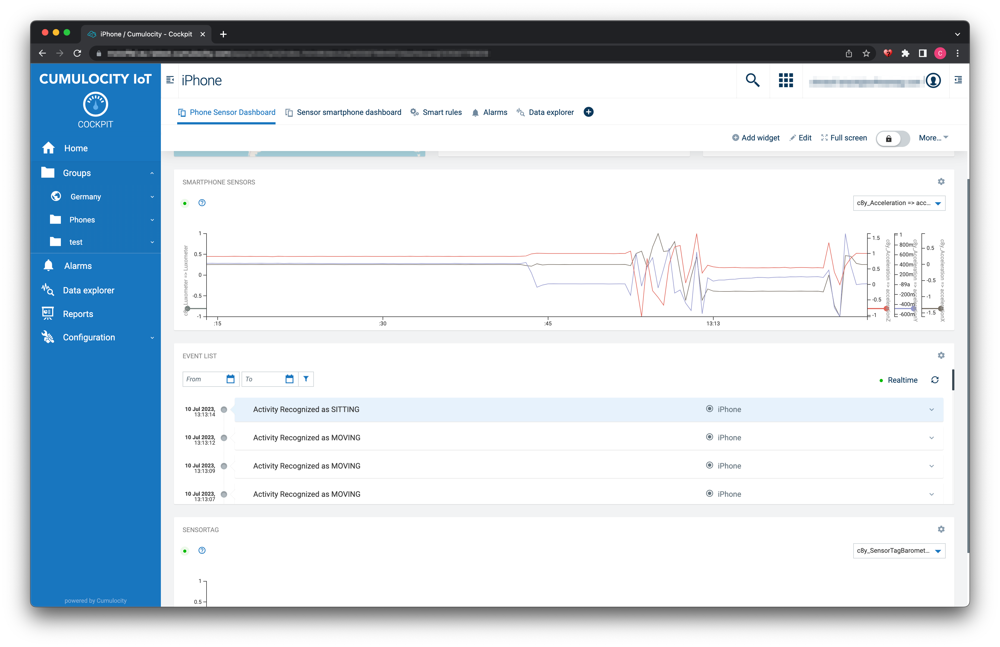

# cumulocity-mlops
This repo outlines the steps required for a complete AI/ML cycle. In involves Cumulocity IoT with the addintional components DataHub for offloading the process data:
1. Export data through DataHub to AWS S3
2. Locate Data in AWS S3
3. Train Model in AWS SageMaker and export in ONNX format
4. Deploy Scoring Microservice in Cumulocity
5. Deploy Ananlytics EPL App for scoring
6. Scoring results

They can they can be viewed in the following diragram:




The out-of-the box extension points, e.g. Cumulocity Microservices & DataHub allow to adapt this solution to your AI/ML requirements.

# Import data using c8y tool

The following commands were used to import the simulation data to Cumulocity:

```
c8y util repeatcsv  --first 1 activity-recognition-demo/data/c8y_Acceleration_Merged_Shuffle_mod.csv | \
    c8y measurements create --device 5558565188 --template "{'time': _.Date(input.value.time, '3months' ), 'c8y_Acceleration': {'accelerationX': {'value': input.value.accelerationX , 'label': input.value.label}, 'accelerationY': {'value': input.value.accelerationY , 'label': input.value.label} , 'accelerationZ': {'value': input.value.accelerationZ , 'label': input.value.label}  } , type: 'c8y_Acceleration'}" --dry
```

In this command you have to update the time offset to match the current date `_.Date(input.value.time, '3months')`.

# Useful links

📘 Explore the Knowledge Base  
Dive into a wealth of Cumulocity IoT tutorials and articles in our [Tech Community Knowledge Base](https://tech.forums.softwareag.com/tags/c/knowledge-base/6/cumulocity-iot). 

💡 Get Expert Answers   
Stuck or just curious? Ask the Cumulocity IoT experts directly on our [Forum](https://tech.forums.softwareag.com/tags/c/forum/1/Cumulocity-IoT).  

🚀 Try Cumulocity IoT   
See Cumulocity IoT in action with a [Free Trial](https://techcommunity.softwareag.com/en_en/downloads.html).  

✍️ Share Your Feedback   
Your input drives our innovation. If you find a bug, please create an issue in the repository. If you’d like to share your ideas or feedback, please post them [here](https://tech.forums.softwareag.com/c/feedback/2).

More to discover
* [Data integration options with Cumulocity IoT](https://tech.forums.softwareag.com/t/data-integration-options-with-cumulocity-iot/263884)  
* [Cumulocity IoT Web Development Tutorial - Part 1: Start your journey](https://tech.forums.softwareag.com/t/cumulocity-iot-web-development-tutorial-part-1-start-your-journey/259613) 
* [The power of micro frontends – How to dynamically extend Cumulocity IoT Frontends](https://tech.forums.softwareag.com/t/the-power-of-micro-frontends-how-to-dynamically-extend-cumulocity-iot-frontends/266665) 

----
These tools are provided as-is and without warranty or support. They do not constitute part of the Software AG product suite. Users are free to use, fork and modify them, subject to the license agreement. While Software AG welcomes contributions, we cannot guarantee to include every contribution in the master project.
