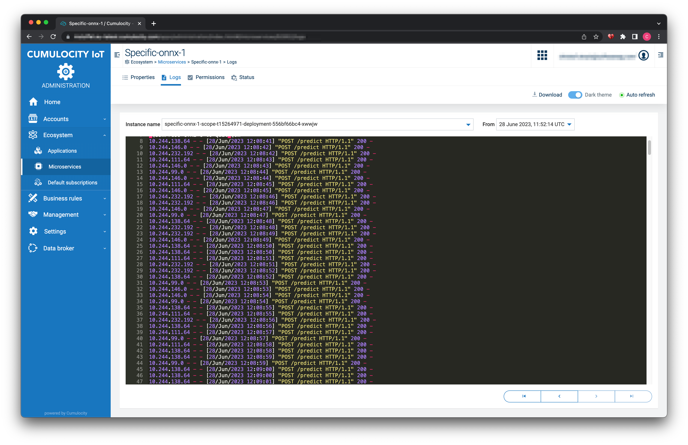

# cumulocity-mlops
This repo outlines the steps required for a complete AI/ML cycle. In involves Cumulocity IoT with the addintional components DataHub for offloading the process data:
1. Export data through DataHub to AWS S3
2. Locate Data in AWS S3
3. Train Model in AWS SageMaker and export in ONNX format
4. Deploy Scoring Microservice in Cumulocity
5. Deploy Ananlytics EPL App for scoring
6. Scoring results

They can they can be viewed in the following diragram:





The out-of-the box extension points, e.g. Cumulocity Microservices & DataHub allow to adapt this solution to your AI/ML requirements.

# Import data using c8y tool

The following commands were used to import the simulation data to Cumulocity:

```
c8y util repeatcsv  --first 1 activity-recognition-demo/data/c8y_Acceleration_Merged_Shuffle_mod.csv | \
    c8y measurements create --device 5558565188 --template "{'time': _.Date(input.value.time, '3months' ), 'c8y_Acceleration': {'accelerationX': {'value': input.value.accelerationX , 'label': input.value.label}, 'accelerationY': {'value': input.value.accelerationY , 'label': input.value.label} , 'accelerationZ': {'value': input.value.accelerationZ , 'label': input.value.label}  } , type: 'c8y_Acceleration'}" --dry
```

In this command you have to update the time offset to match the current date `_.Date(input.value.time, '3months')`.